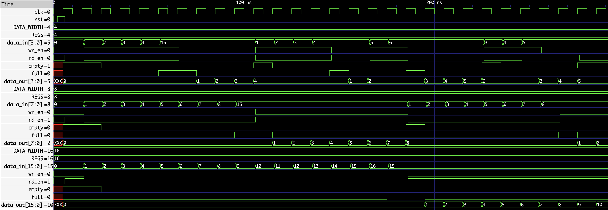
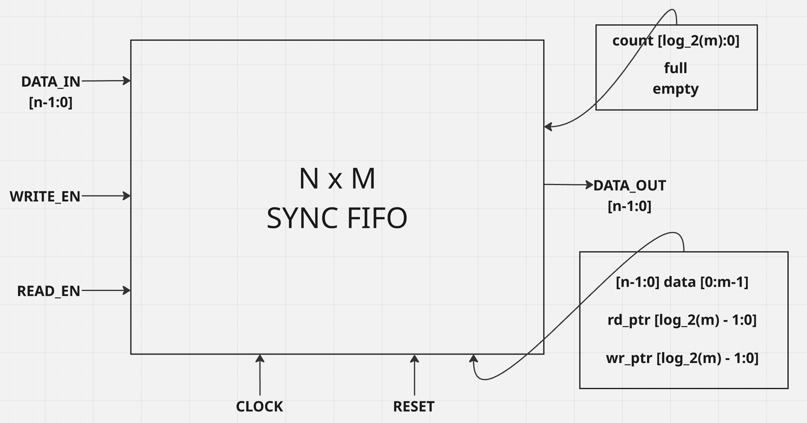

# Parameterized Synchronous FIFO

A reusable synchronous FIFO (First-In, First-Out) buffer written in SystemVerilog. The design is parameterized for data width and FIFO depth, making it suitable for a range of RTL and VLSI design experiments without changing the core architecture.

## Overview

This project implements an `N × M` synchronous FIFO:

- `N` is the width of each stored data word.
- `M` is the number of entries in the FIFO.

All state changes occur on the active clock edge. The FIFO stores incoming data when writing is enabled, returns data in first-in/first-out order when reading is enabled, and provides `full` and `empty` status flags for flow control.

## Features

- Parameterized data width (`N`)
- Parameterized FIFO depth (`M`)
- Synchronous clocked operation
- Internal memory organized as `data[0:M-1]`
- Independent read and write pointers
- Pointer and count sizing derived using `$clog2(M)`
- `full` and `empty` status flags
- Generic parameterized testbench
- GTKWave waveform verification

## Architecture / How It Works

The FIFO uses an internal memory array to hold `M` words, each `N` bits wide. A write pointer selects the next location to receive data, while a read pointer selects the next location to be read.

- When `WRITE_EN` is asserted and the FIFO is not full, `DATA_IN` is written to the location selected by the write pointer. The write pointer advances and the stored-word count increases.
- When `READ_EN` is asserted and the FIFO is not empty, data from the location selected by the read pointer is presented on `DATA_OUT`. The read pointer advances and the count decreases.
- The count tracks FIFO occupancy. It is used to determine the empty and full conditions.
- `RESET` initializes the FIFO control state, including its pointers and occupancy tracking.

The pointer and occupancy-related widths are calculated from the configured depth using `$clog2(M)`, so the control logic scales with the selected FIFO size.

## Interface

| Signal | Width | Direction | Description |
|---|---:|---|---|
| `CLOCK` | 1 bit | Input | System clock for synchronous FIFO operation |
| `RESET` | 1 bit | Input | Resets FIFO control state |
| `DATA_IN` | `N` bits | Input | Data presented for a write operation |
| `WRITE_EN` | 1 bit | Input | Requests a write operation |
| `READ_EN` | 1 bit | Input | Requests a read operation |
| `DATA_OUT` | `N` bits | Output | Data read from the FIFO |
| `FULL` | 1 bit | Output | Asserted when no more entries can be written |
| `EMPTY` | 1 bit | Output | Asserted when no entries are available to read |

## Parameters

| Parameter | Meaning |
|---|---|
| `N` | Data width in bits; determines the width of `DATA_IN` and `DATA_OUT` |
| `M` | FIFO depth; determines the number of memory entries |

For a selected configuration, the internal storage is `data[0:M-1]`, and pointer/count sizing is derived from `$clog2(M)`.

## Verification

The repository includes a generic, parameterized SystemVerilog testbench for exercising the FIFO across configurable widths and depths. Simulation waveforms are generated and inspected in GTKWave to visually validate the FIFO behavior and its control flags.

## Tools

- SystemVerilog
- Icarus Verilog
- GTKWave

## Repository Structure

```text
.
├── README.md             # Project documentation
├── design.sv             # Parameterized synchronous FIFO RTL
├── testbench.sv          # Generic parameterized testbench
├── block_diagram.png     # FIFO architecture diagram
└── waveform.png          # Simulation waveform
```

## Waveform

The simulation waveform can be inspected in GTKWave to follow clock, reset, read/write control, data movement, and FIFO status signals.



## Block Diagram

The block diagram illustrates the data memory, read and write pointer control, occupancy tracking, and full/empty flag generation.



## Future Improvements

- Add assertions for overflow and underflow protection
- Extend the verification environment with constrained-random stimulus
- Add functional coverage for FIFO operating scenarios
- Support configurable read-data behavior
- Develop an asynchronous FIFO variant for clock-domain-crossing applications

